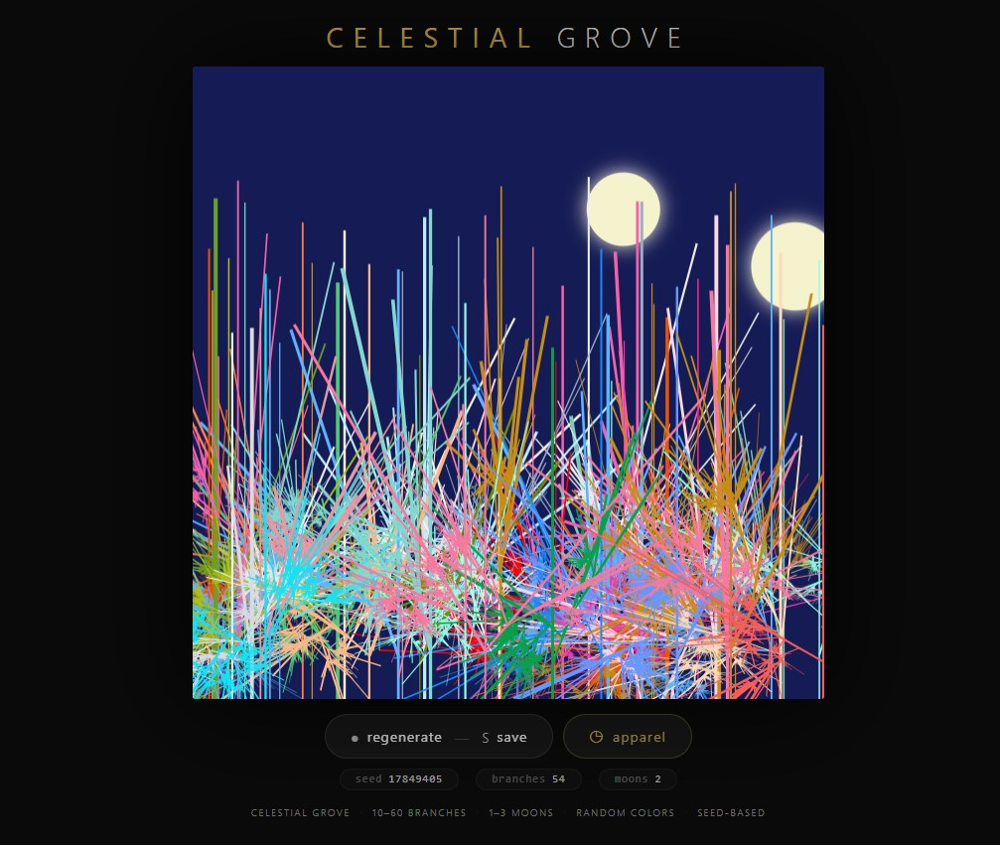
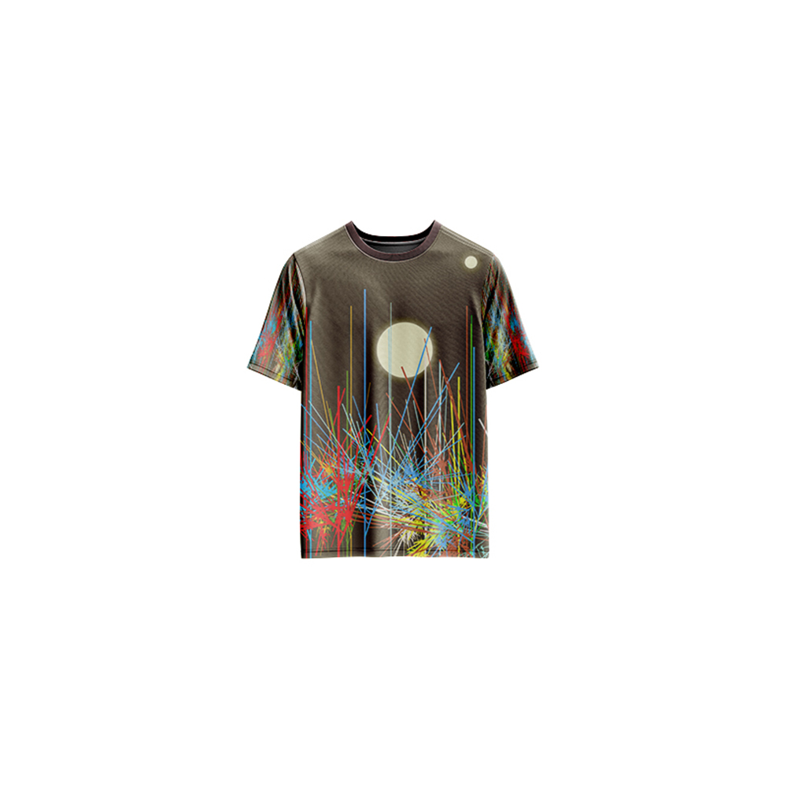

# Celestial Grove — Generative Art

[](https://reyrove.github.io/Celestial-Grove-Generative-Art)
[](https://opensource.org/licenses/MIT)

> **Generative celestial tree art.** Each refresh creates a unique grove of colorful branching trees beneath glowing moons, with dark cosmic backgrounds and seed-based patterns.

## 🎨 Live Demo

<div align="center">
  <a href="https://reyrove.github.io/Celestial-Grove-Generative-Art" target="_blank">
    
  </a>
  <br><br>
  <a href="https://reyrove.github.io/Celestial-Grove-Generative-Art" target="_blank">
    
  </a>
  <br>
  <em>Click the image or button to experience the generative art</em>
</div>

## 👕 Apparel Preview

<div align="center">
  
  <br>
  <em>Celestial Grove artwork printed on a T-shirt</em>
</div>

## ✨ Features

- **Celestial Trees** — Recursive branching trees with organic patterns
- **Glowing Moons** — 1-3 warm, luminous moons in the night sky
- **Dark Cosmic Backgrounds** — 21 deep space color palettes
- **Vibrant Branch Colors** — 50+ colors for tree branches
- **Seed-Based** — Every composition is unique and reproducible via its seed
- **Save & Share** — Download as PNG with seed in filename
- **Apparel Mode** — Preview artwork on a T-shirt mockup
- **Responsive** — Works on desktop, tablet, and mobile
- **Pure JavaScript** — No external dependencies
- **Keyboard Shortcuts**:
  - `R` — Regenerate
  - `S` — Save image
  - `T` — Toggle apparel view

## 🎨 Artwork Details

| Parameter | Range | Description |
|-----------|-------|-------------|
| **Number of Branches** | 10–60 | Random tree branches |
| **Background Colors** | 21 options | Dark cosmic color palette |
| **Branch Colors** | 50+ options | Vibrant random colors |
| **Number of Moons** | 1–3 | Glowing celestial bodies |
| **Moon Size** | Variable | Random sizes up to 1/10 canvas |
| **Tree Depth** | Up to 13 | Recursive branching depth |

## 🚀 Quick Start

### Local Development

```bash
# Clone the repository
git clone https://github.com/reyrove/Celestial-Grove-Generative-Art.git

# Navigate to the directory
cd Celestial-Grove-Generative-Art

# Open in browser
open index.html
# or use a live server
```

### Deploy to GitHub Pages

1. Push to GitHub
2. Go to Settings → Pages
3. Select branch `main` and root folder
4. Your site will be live at `https://reyrove.github.io/Celestial-Grove-Generative-Art`

## 🧠 How It Works

The artwork is generated using a deterministic random number generator, seeded by timestamp + random noise. Every refresh:

1. **Setup**:
   - Chooses a dark cosmic background from 21 colors
   - Determines number of branches (10-60)
   - Assigns random colors to each branch from 50+ vibrant colors
   - Decides number of moons (1-3)

2. **Tree Generation**:
   - Each tree starts at the bottom of the canvas
   - Recursive branching creates organic patterns
   - Branch length and angle vary randomly
   - Depth up to 13 levels

3. **Moon Rendering**:
   - Moons placed in the upper half of the canvas
   - Warm golden glow effect
   - Random sizes and positions

4. **Rendering**:
   - All elements drawn on dark cosmic background
   - Trees with vibrant, glowing branch colors
   - Celestial atmosphere with moons

## 📁 File Structure

```
Celestial-Grove-Generative-Art/
├── index.html              # Main application (all-in-one)
├── Celestial-Grove.jpg     # T-shirt mockup image
├── fav.svg                 # Favicon
├── demo-screenshot.jpg     # Website demo screenshot
├── README.md               # This file
└── LICENSE                 # MIT License
```

## 🛠️ Tech Stack

- **Pure Vanilla HTML/CSS/JS** — No dependencies
- **Canvas API** — 2D rendering
- **CSS Flexbox/Grid** — Responsive layout
- **GitHub Pages** — Hosting

## 🎯 Interactive Controls

| Action | Keyboard | Button |
|--------|----------|--------|
| Regenerate | `R` | Click "regenerate" |
| Save Image | `S` | Click "regenerate" |
| Toggle Apparel | `T` | Click "apparel" |

## 🎨 The Creative Process

### Recursive Trees
The trees are generated using recursive branching. Each branch splits into smaller branches, creating organic, fractal-like patterns. The depth of recursion (up to 13 levels) creates rich, detailed structures.

### Celestial Atmosphere
The dark cosmic backgrounds paired with glowing moons create a mystical, otherworldly atmosphere. The warm golden moon glow contrasts beautifully with the cool dark backgrounds.

### Color Harmony
Each branch gets a unique color from a palette of 50+ vibrant colors, creating a stunning display of color harmony against the dark background.

## 📱 Responsive Design

The application automatically adapts to:
- Desktop screens
- Tablets
- Mobile phones
- Landscape orientation
- Various aspect ratios

## 🤝 Contributing

Contributions are welcome! Feel free to:
- Fork the repository
- Create a feature branch
- Submit a pull request

### Ideas for Contributions:
- New tree generation algorithms
- Additional color palettes
- Enhanced celestial effects
- Star or constellation additions
- Performance optimizations

## 📄 License

MIT License — see [LICENSE](LICENSE) file for details.

## 🙏 Acknowledgments

- Inspired by celestial trees and cosmic landscapes
- Pure JavaScript implementation
- Special thanks to the creative coding community

---

**Built with ❤️ and celestial wonder**